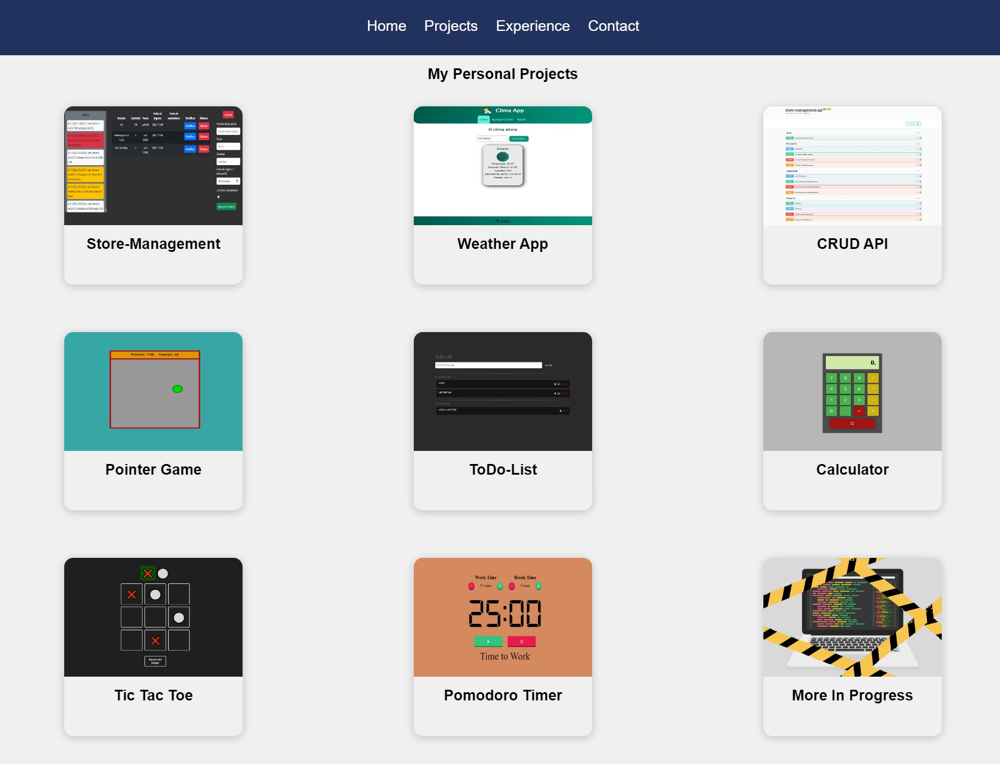

# Portfolio

This is my personal portfolio, which was created using React and is completely responsive. In this portfolio, you can find information about the technologies I know, the projects I have developed, my experience, and a contact form so you can get in touch with me.

## Home

On the main page of my portfolio, you will find information about the technologies I know. Here you can find a brief description of each of them and a link to my GitHub profile, where you can find projects I have developed using these technologies.

## Projects

In this section, you will find information about all the projects I have developed. Each project has a brief description and a sample image. You can also find a link to the project's source code on my GitHub profile.

## Experience

In this section, you can find information about the things I have been studying over the years. Here you can find a list of technologies, tools, and programming languages that I have been learning and improving over time.

## Contact

If you want to get in touch with me, you can do so through the contact form located in this section. Simply fill out the required fields and send me your message. I will get back to you as soon as possible.

## How to use the project

1. Clone the repository on your local machine.
> git clone https://github.com/your-username/your-repository.git
2. Open the terminal and navigate to the project directory.
> cd your-repository
3. Run the following command to install dependencies:
> npm install
4. Run the following command to start the development server:
> npm start
5. Open your browser and navigate to http://localhost:3000.

That's it! Now you can explore my personal portfolio and learn more about my skills, projects, and experience. If you have any questions or suggestions, feel free to contact me through the contact form.

## Screenshot

    

## Test Project

> https://portfolio-lucasbutto.vercel.app/
